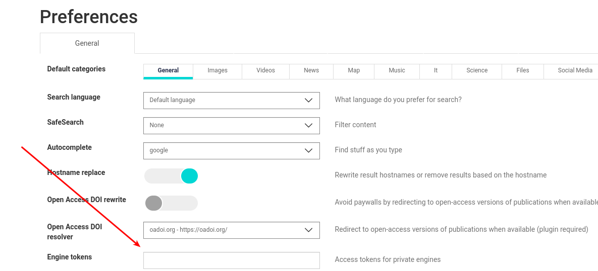

=============================
How to create private engines
=============================

If you are running your public searx instance, you might want to restrict access
to some engines. Maybe you are afraid of bots might abusing the engine. Or the
engine might return private results you do not want to share with strangers.

Server side configuration
=========================

You can make any engine private by setting a list of tokens in your settings.yml
file. In the following example, we set two different tokens that provide access
to the engine.

.. code:: yaml

    - name: my-private-google
      engine: google
      shortcut: pgo
      tokens: ['my-secret-token-1', 'my-secret-token-2']

To access the private engine, you must distribute the tokens to your searx
users. It is up to you how you let them know what the access token is you
created.

Client side configuration
=========================

As a searx instance user, you can add any number of access tokens on the
Preferences page. You have to set a comma separated lists of strings in "Engine
tokens" input, then save your new preferences.

Once the Preferences page is loaded again, you can see the information of the
private engines you got access to. If you cannot see the expected engines in the
engines list, double check your token. If there is no issue with the token,
contact your instance administrator.

