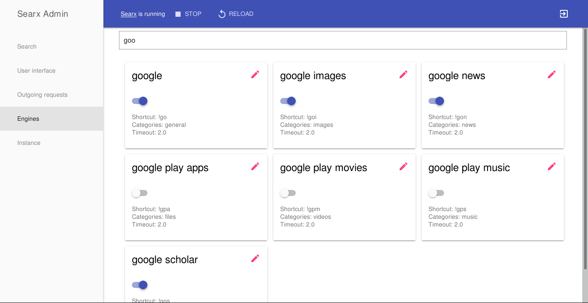

Searx admin interface: manage your instance from your browser
=============================================================

One of the biggest advantages of searx is being extremely customizable. But at first it can be daunting to newcomers.
A barrier of taking advantage of this feature is our ugly settings file which is sometimes hard to understand and edit.

To make self-hosting searx more accessible a new tool is introduced, called ``searx-admin``.
It is a web application which is capable of managing your instance and manipulating its settings via a web UI.
It aims to replace editing of ``settings.yml`` for less experienced administrators or people
who prefer graphical admin interfaces.

    
    Configuration page of engines

Since ``searx-admin`` acts as a supervisor for searx, we have decided to implement it
as a standalone tool instead of part of searx. Another reason for making it a standalone
tool is that the codebase and dependencies of searx should not grow because of a fully optional feature,
which does not affect existing instances.

Installation
------------

Installation guide can be found in the repository of searx-admin:
https://github.com/kvch/searx-admin#installation--usage

Acknowledgements
----------------

This development was sponsored by `NLnet Foundation`_.

.. _NLnet Foundation: https://nlnet.nl/

| Happy hacking.
| kvch // 2017.08.22 21:25
